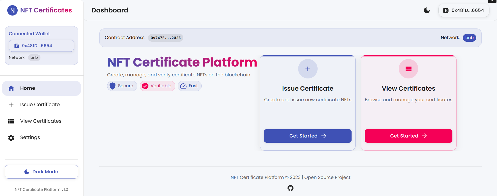

# NFT Certificate Issuance Platform

An open-source platform for issuing and managing NFT certificates on Ethereum-compatible networks. This platform allows educational institutions, businesses, or organizations to create verifiable digital certificates as NFTs.



## Features

- ✅ Connect to MetaMask wallet
- ✅ Issue NFT certificates with custom metadata
- ✅ Upload certificate images to IPFS
- ✅ View all issued certificates
- ✅ Search and filter certificates
- ✅ Verify certificate authenticity
- ✅ User-friendly interface with animations
- ✅ Development mode with mock blockchain & IPFS

## Project Structure

The project consists of three main components:

1. **Smart Contract**: Solidity-based NFT contract for certificate issuance
2. **Frontend**: React application with Material UI components
3. **Backend**: Python FastAPI server with Web3 and IPFS integration

```
nft-certificate-platform/
├── frontend/             # React frontend application
├── backend/              # Python FastAPI backend server
├── smart_contract/       # Solidity smart contracts
├── scripts/              # Helper scripts for running the platform
├── run.bat               # Windows launcher script
├── run.sh                # Linux/macOS launcher script
├── README.md             # This documentation
└── .gitignore            # Git ignore file
```

## Prerequisites

- **Node.js** (v16 or higher)
- **Python** (v3.8 or higher)
- **MetaMask** browser extension (for production use)
- **Git**

## Quick Start (One-Click Launch)

### Windows

1. Clone the repository:
   ```
   git clone https://github.com/yourusername/nft-certificate-platform.git
   cd nft-certificate-platform
   ```

2. Set up the environment:
   ```
   cd frontend && npm install && cd ..
   cd backend && pip install -r requirements.txt && cd ..
   ```

3. Launch the application with a single click:
   ```
   .\run.bat
   ```

4. Open your browser and navigate to: http://localhost:3000

### Linux/macOS

1. Clone the repository:
   ```bash
   git clone https://github.com/yourusername/nft-certificate-platform.git
   cd nft-certificate-platform
   ```

2. Set up the environment:
   ```bash
   cd frontend && npm install && cd ..
   cd backend && pip install -r requirements.txt && cd ..
   ```

3. Make the launch script executable and run it:
   ```bash
   chmod +x run.sh
   ./run.sh
   ```

4. Open your browser and navigate to: http://localhost:3000

## Manual Startup

### Windows (PowerShell)

Start each server in a separate terminal:

```powershell
# Terminal 1 - Backend
cd backend; python -m uvicorn main:app --reload

# Terminal 2 - Frontend
cd frontend; npm start
```

### Linux/macOS

Start each server in a separate terminal:

```bash
# Terminal 1 - Backend
cd backend && python -m uvicorn main:app --reload

# Terminal 2 - Frontend
cd frontend && npm start
```

## Development Mode

The platform operates in development mode by default with mock implementations of blockchain and IPFS services. This allows you to test the platform without connecting to actual networks.

## Smart Contract Deployment (Optional)

For production use, you'll need to deploy the smart contract to an actual network:

```bash
cd smart_contract
npm install
npx hardhat compile
npx hardhat run scripts/deploy.js --network <your-network>
```

After deployment, update the contract address in the `.env` file:

```
CONTRACT_ADDRESS=<your-deployed-contract-address>
```

## Configuration

### Backend Configuration

Create a `.env` file in the `backend` directory:

```
# Network Configuration
NETWORK_RPC_URL=http://localhost:8545
CONTRACT_ADDRESS=0x5FbDB2315678afecb367f032d93F642f64180aa3
PRIVATE_KEY=your-private-key-for-production

# IPFS Configuration (optional)
PINATA_API_KEY=your-pinata-api-key
PINATA_SECRET_KEY=your-pinata-secret-key

# Mock settings
USE_MOCK_CONTRACT=True
USE_MOCK_IPFS=True
```

### Frontend Configuration

Create a `.env` file in the `frontend` directory:

```
REACT_APP_API_URL=http://localhost:8000
```

## Troubleshooting

### Common Issues

1. **"Cannot find module 'X'"**:
   - Make sure you've run `npm install` in the frontend directory
   - Check that the module is listed in package.json

2. **"Could not import module 'main'"**:
   - Make sure you're running the backend from inside the `backend` directory
   - Use `cd backend; python -m uvicorn main:app --reload` on Windows
   - Use `cd backend && python -m uvicorn main:app --reload` on Linux/macOS

3. **"Certificate not found" after creation**:
   - This is likely a token ID tracking issue
   - Restart both the backend and frontend servers

4. **PowerShell command chaining**:
   - Use semicolons (`;`) instead of `&&` in PowerShell
   - Example: `cd backend; python -m uvicorn main:app --reload`

## Contributing

Contributions are welcome! Please feel free to submit a Pull Request.

## License

This project is licensed under the MIT License - see the LICENSE file for details. 